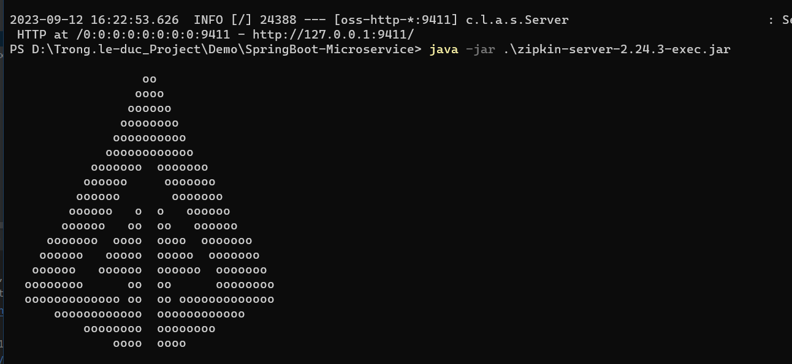
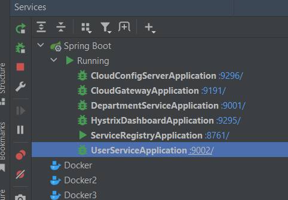
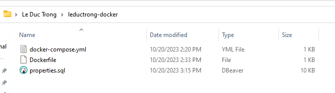
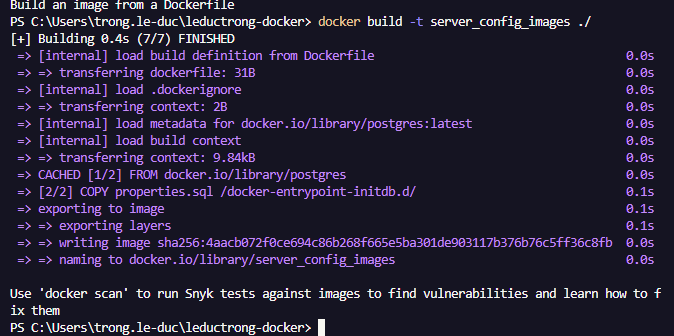
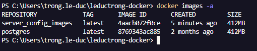
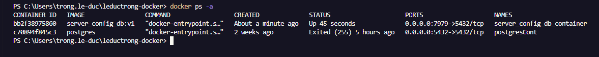
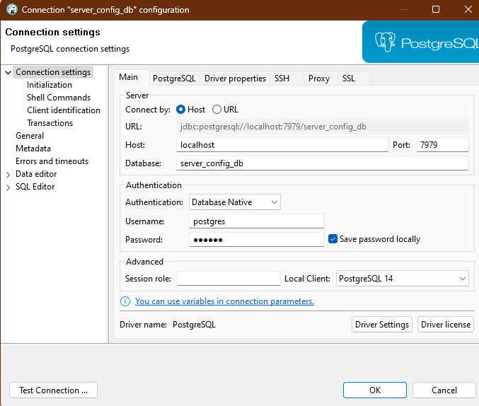

1. open command in folder project and using cmd: "java -jar .\zipkin-server-2.24.3-exec.jar" to run zipkin(open zipkin after run success: "http://127.0.0.1:9411/zipkin/" )

2. Run registry-service first -> config-service -> gateway-service -> any service you want to run

3. find some api to test as attatchment file "API.json" in project. 

4. for more detail how to build this project u can explore more at:'https://www.youtube.com/watch?v=BnknNTN8icw'

////////////////////////////////////  HOW TO USING DOCKER TO CREATE DATABASE  /////////////////////////////////////////////////////
1. Create folder to contain DockerFile and .sql file :
2. Run cmd : "docker build -t <image_name> ./" ex: 'docker build -t server_config_db:v1 ./'

3. Run cmd 'docker images -a' show all images to check is existed: 
4. Run cmd 'docker run -d --name server_config_db_container -p 7979:5432 server_config_db:v1'
5. Run cmd 'docler ps -a' and copy CONTAINER ID to start CONTAINER. Run cmd 'docker start <CONTAINER_ID>';
ex:  -> 'docker start bb2f38975860'
6. Now we can using data from 'docker ps -a' to connect database: 
7. Run sql to setup database
